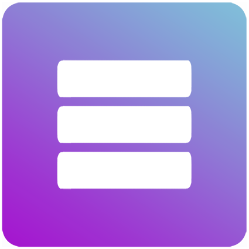
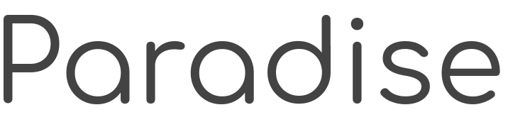

Paradise is an initiative to change the current layout of social media in how content is being delivered and how the content is being consumed. We want to transform the content delivery from one-to-all to all-to-one. The One-to-all style of delivery is when a user’s shares/posts is by sent to all its followers. What we propose is the All-to-one style, this being that all the content is meant for specific type of users. 

A good analogy to put into perspective our vision is to picture the internet as a sea of ideas and trends. Sometimes when you search the web, you get hit by content that you don't want to deal with.
Instead of tolerating irrelevant/offensive/random content, what if you could select the kind of content you want to ride. Hence the concept of **waves**, a form of a profile that contained content that interests you.

## Problems:
- We assume (As the project evolves, a real study might be necessary)  that we find it irritating to see ads about something random right after seeing the picture of grandma. This current flow does not effectively help users engage in all of their received content, such as the content found in Instagram.

- The current layout of content distribution mixes topics from politics to celebrity scandals. This is due to the nature of one-to-all style, where everybody shares all their interests to one thread and that thread is intended to all its followers.That being said, we end up with low quality content (By our definition, quality content is the content that is most closely related to the user’s expectation).

## Approach:
- Implement the all-to-one content distribution system. As a tool to implement this system we introduce the concept of waves. A wave doesn’t represent a person, it represents the essence of a community/topic. The concept of wave helps us define what type of content the user wants to see. In a more detailed level a wave comes with a wall (reference to Facebook’s wall). This space is where all content that belongs to the wave will be displayed. To comply with the promise that all contents are meant for a given wave, the community who’s riding such wave will echo the content that they find relevant in order to keep it alive. Echo is also a new concept/tool that will help users curate the content inside waves. Every content comes with a 24 hour time to live, everytime someone echos the content, the time resets. The content becomes permanent once a third of the members of the wave have echoed it. This ensures that the content is relevant and related to the wave. 

- The user can ride multiple waves at the same time; like joining groups. This allows users to select what  type of content they want to consume. This solves the problem of the one-to-all style. It even gives us (the developers) a possible addition to the app that allows the user to select certain waves to provide a personal wall. The user can select its favorite waves and have a feed that only contain content from the selected waves.

- Gamifying the whole process of posting is also key for our approach.If a third of the members of a wave echo a post, this post stays in that wave’s wall. We want to give credit to the user that posted the post for posting relevant/good content in a wave. So in a rough presentation (for now) such user gets a point. “Points” (the word points being used as a placeholder) represent all the good posts that the user has posted, this is wave independent. This approach will also motivate users to post more relevant/cool content. Looking it from another perspective, instead to saying “oh look how many followers that person has”, people will say “oh look how many posts that person has”. Also this way we make it easier to distinguish good content creators.

## Use case, people:
Imagine having three different **_waves_**: family, school, and friends.
- **Family**: This wave contains people that are only part of your family. All of the content being shared here is only relevant to you and to each of the present. Unlike other social media where content isn't sectioned out from your faimly, **_waves_** can give you the advantage of keeping your social platforms _wholesome_ ♥️. 
- **School**: Whether a user is in high school or in college, there is something good about being part of a group. Let's say one of your school's clubs is having a meetup. Publishing the announcement in the school's **_wave_** can reach a larger audience. This is more likely to reach a larger audience because when students use their school's wave, they expect what content to engage with; therefore less predisposed to dismiss it. 
- **friends**: Now here is the were the concept of **_waves_** shine the most. Each person carries a different wavelength when describing personality. Different waves for different group of friends. It's all about the inside jokes.

There's a distinction between a wave and a groupchat. It's not common to have groupchat's with strangers, but in foli, strangers would a ride waves with you (cool strangers).
Waves are more than a physical collective of people. They can also represent ideas and topics.

## Use case, topics/ideas:
When people generate ideas and believe its relevance, they tend share it on the internet. The problem is that some of those ideas might no longer interest us, or we may easily dismiss them due to bad timing. It doesn't help that the internet holds such a gigantic amount of information that it overwhelms us from time to time. Now, imagine that you are riding two waves: conspiracy theories and sloths.
There's no reason why a sloth and conspiracy theories should go together, unless you decide to make a wave for sloths and conspiracy theories :poop:.

## Current State of the App:
Currently the app layout is divided into four fragments:
- **Me**: Displays username, numbers of waves, contacts and a list of the waves that the user is part of.
- **Wave**: Is meant to hold the actual content of the wave. This being posts, etc.
- **Explore**: Here is were the user is going to engage with new sources of content. Explore has a **_curated_** list of publi global and local waves available to join. 
- **Chat**: Holds the chat rooms that the user has engaged in.

## Looking Forward:
Idea currently being contemplated based on each fragment.
- **Wave**: With the idea in mind of keeping the user engaged, I'll like to introduce the concept of sub-wave. When the user is inside a wave, it will allow it to swipe through the different sub-waves (topics). Such sub-waves can have temporary life or not. More to expand later. 

## Getting Started
Currently, paradise is only being developed for Android. So is doesn't matter what OS you are running, Android Studio should work fine.

### Prerequisites
- [Android Studio](https://developer.android.com/studio/)

### Installation
After installing Android studio, download the project using the project's GitHub link. Android studio offers an easy integration with github to complete this step.
Inside Android Studio do the following:
- Go to **File**->**New**->**Project from Version Control**->**_GitHub_**.
- After loggin in, if you have permission (Duh if you are seeing this you do) select ProjectParadise from the URL options (_https://github.com/JamMarHer/ProjectParadise_).
- Click on Clone.

After installing, foli should be ready for testing and development.

## Running

After clonning the project, give it a run in the emulator. foli is currently being tested with an emulated phone _running on Android P, on a Pixel 2 XL_.
It is also being tested on a Samsung Galaxy S9+ running Android P.
The Android emulator comes included with Android Studio but if you want more info, [here](https://developer.android.com/studio/run/emulator) is the link.

## Built With

* [Android Studio](https://developer.android.com/studio/) - Android's SDK
* [Firebase](https://maven.apache.org/) - Web backend
* [ZXing](https://github.com/zxing/zxing) - QR scanner
* [CircleImageView](https://github.com/hdodenhof/CircleImageView) - Circular ImageViews

